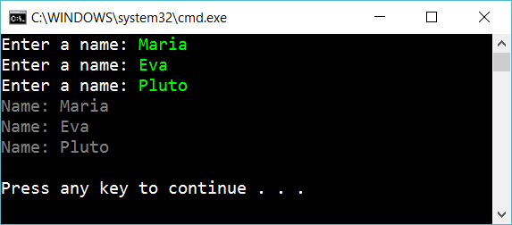

# 10.1 Array

Create a method:

    void ThreeNamesWithArray()

…that ask for three names, build an array and then display the names in the array:

## Extra

1. From the input above, a scrambled text should be written:

	    MaEvPlriaauto

Figure out how this string is created. Then create a method that do this.

2. This is another transformation:

	    MMMMMEEEPPPPP

Figure out how this string is created. Then create a method that do this.

3. Create a *testproject* with testmethods to assert that your code don't have bugs