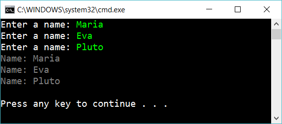

# 10.2 List

Create a method that works the same as the previous exercise (10.1). But use a List<string>

## Extra

1. Create a class Cat with two properties: Name and IsAnnoying. Let the user input three cats and build a List<Cat>. Then write the list:

	    Musse is annoying
	    Lukas is ok
	    Julia is ok

2. Add one enum property *Race* to the Cat-class. Let the user input this and then display

3. Create a *testproject* with testmethods to assert that your code don't have bugs