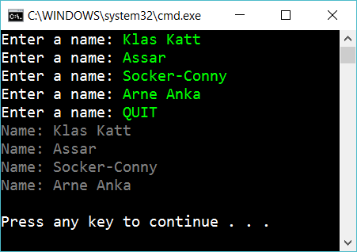

# 10.3 List of unknown length

Create this app:

The use should enter as many names as she likes. When she enters quit then display the content of the list. Use a List<string> to solve this.

## Extra

1. Use a speech synthesizer that says which is the longest text:

	“Oh! Socker-Conny is a very long name, indeed”

2. Create a *testproject* with testmethods to assert that your code don't have bugs. What part of your application is suitable to test?