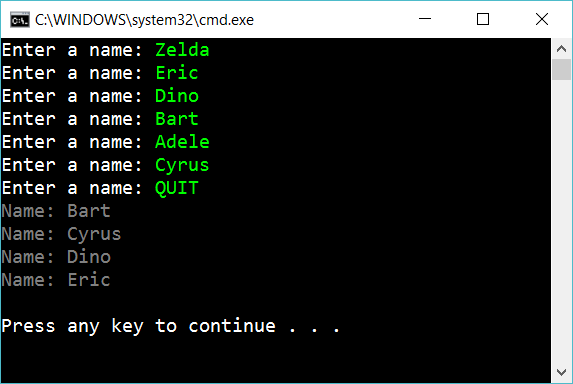

# 10.4 Manipulate a list

Create an app that ask for names, until the user write quit. Then sort the list and after that removes the first and last element in the list: 

## Extra

1. Create an app that ask for numbers (until QUIT) and then calculate the mean and median values of the list

2. Create an app that read monsters from and JSON-file. Create a List<Monster> and write the list in a pretty way to the screen.

3. Create a *testproject* with testmethods to assert that your code don't have bugs