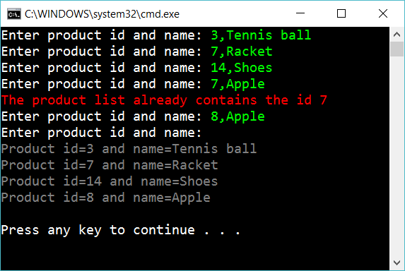

# 10.5 Product list with dictionary

Create the following console app:

Let the user input products. A product is supposted to be entered as a number and a description. Separated with comma. When the user just press enter, then display the content of the products.

If the user enter a product’id that is already taken, then respond with an error message.

## Extra

1. Add one more property for Product and use it in the program

2. A product can be sold in zero, one or many Stores. Add necessary code for this (so the user can input a product together with stores)

3. Create a *testproject* with testmethods to assert that your code don't have bugs