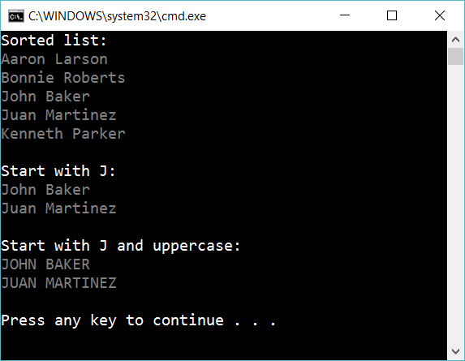

# 11.1 Work with a list of string

(Hard!) Ask for the file *PersonShort.csv* 

Implement a class Parser, that should work in this way:

    var parser = new Parser();
    List<string> list = parser.CreateListOfNames("PersonShort.csv");

Now create an app that sort the list, filter the list and manipulate the result. Like this:

## Extra

1. Write down all kind of errors that could exist in the file PersonShort.csv

2. Implement error handeling, so the user get clear respons if there are one or more errors in the file. Try to make as many different error messages as possible (to help the user).

3. Create a *testproject* with testmethods to assert that your code don't have bugs