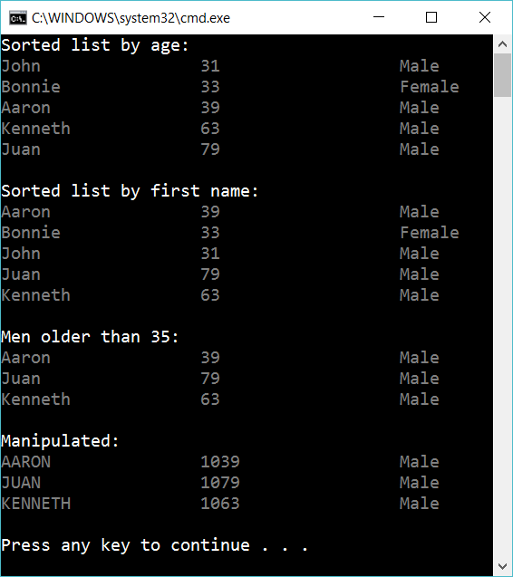

# 11.2 Work with list of Customers

(Hard!) Ask for the file *PersonShort.csv* and *PersonExtra.csv*

Implement a class Customer. Add an enum-property where it’s necessary.

Create the class *Parser*, that should work in this way:

	var parser = new Parser();
	List<Customer> list = parser.CreateListOfCustomers("PersonShort.csv");

Now create this app:

 
The app should sort the customers by age, then by name. After that show customers that are men and older than 35. 

Finally manipulate the result so the name is in capitals and you add the age by 1000. Use *Select* to solve this.

## Extra

1. Write down all kind of errors that could exist in the file PersonShort.csv

2. Implement error handeling, so the user get clear respons if there are one or more errors in the file. Try to make as many different error messages as possible.

3. Implement one more way of sorting the list

4. Implement one more way to manipulate the list.

5. Put your csv files (PersonShort.csv, PersonHard.csv...) in the same folder. When the program start ask read the content of that folder and ask the user which datafile he want to use.

6. Add a **settings.json**-file where you can configure which order to display the sorting/manipulation

7. Update settings.json and your app so you can configure which type of sorting, filtering and manipulation that you want to make.

8. Add advanced error-handeling for settings.json. Try to spot all kind of errors in the file, e.g “you probably forgot to add a **}**

9. Put settings.json on a public website and let your program read that file

10. Create a *testproject* with testmethods to assert that your code don't have bugs