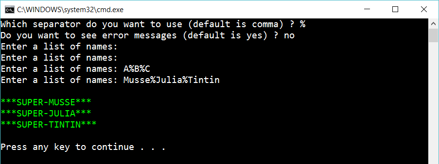

# 4.4 More options

Continue on the app and let the user decide on which separator to use and if he/she wants to see error messages:

 
In the example above the user didn’t want to see error messages.

## Hint

To solve this, create two more methods:

	char AskUserForSeparator()
	bool AskUserForErrorMessage()

## Extra

1. Create a *testproject* with testmethods to assert that your code don't have bugs

2. When the list (in green) is displayed, instead of quitting to program: let the user decide if he/she want do enter a list again or quit the program

3. Create a file *Yes.txt*, that contains “yes” in diffent languages: “yes,ja,si,oui”. Allow the user to enter any one the words as “yes”. Create a file *No.txt* that works the same way.

4. Stop using Yes.txt and No.txt. Create a XML-file *settings.xml* that contains default values (for the two first questions) and “yes” and “no” in different languages.

5. Create a JSON-file *settings.json*, that works the same way as the XML-file.