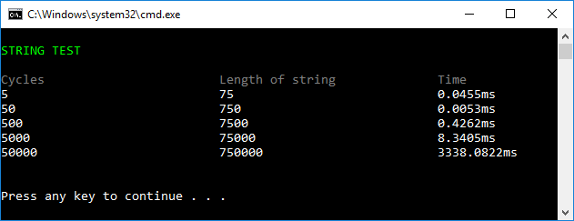

# 5.1 Work with objects (StopWatch)

Create a method

	string GenerateString(string repeatme, int cycles)

that repeats a string a number of times. If the parameter repeatme is “Tennis anyone? ” and cycles is 5, then this string should be returned:
	
    Tennis anyone? Tennis anyone? Tennis anyone? Tennis anyone? Tennis anyone?

Combine strings this way:

    result = result + repeatme;

Use a *Stopwatch* to see how long time the creation of a string takes. Try different amount of cycles:

 

## Extra

1. Make the result beautiful: use colors and adjust the position of the numbers (so it looks better than above)

2. Add one more column that displays the time compared to the first row

3. Make the test using 1,2,3 … 100 cycles. Write the result in a textfile. Display the score  using a graph (write your own program or use something existing).