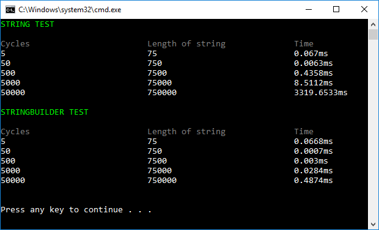

# 5.2 Work with objects (StringBuilder)

Continue on the previous app. Create a new method:

    string GenerateString_StringBuilder(string repeatme, int cycles)

…that do the same thing as *GenerateString*, but it uses *StringBuilder*. 

Then compare how long time it takes to create string with StringBuilder:

## Extra

1. Explain the diffence in the result

2. Find the exact point when “string test” is faster than “stringbuilder test”

3. Make the test three times for 50.000 cycles. Calculate the median. Compare your time to your colleagues.