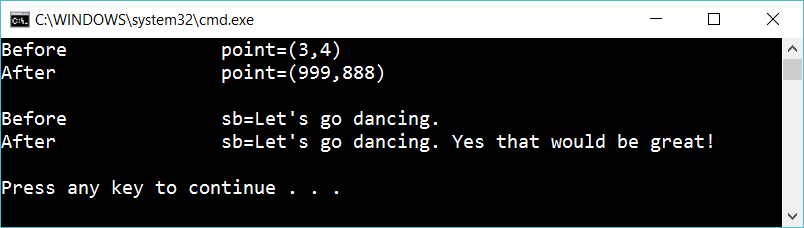

# 5.3 Reference types

Create a class **Point** with the properties X and Y.

Create a method that changes the value X and Y values of a Point:

	void ChangePoint(Point point)

Create a method that adds a message to a StringBuilder:

 	void ChangeStringBuilder(StringBuilder sb)

Create a point with X=3 and Y=4. Call ChangePoint.
Create a stringbuilder with a text. Call ChangeStringBuilder.

Display the result. It should look like this:

## Extra

1. Create one more class (e.g Animal). Create one method that changes an instance of your class (similair as above)