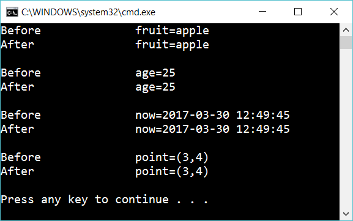

# 5.4 Value types

Create a struct and name it Point_Struct. It should have the same properties as Point.

Create the following  methods:

    void ChangeFruit(string fruit)
    void ChangeAge(int age)
    void ChangeDate(DateTime date)
    void ChangePoint(Point_Struct point)

The methods (tries to) change the incoming values.

Create a string, a date and a Point_Struct. Write the value and then call the methods above to change the values.

It should look like this:

 

## Extra

1. Which types are value types and which are reference types?

2. Compare exercise 5.3 with this exercise