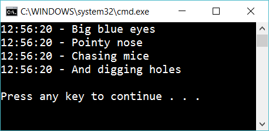
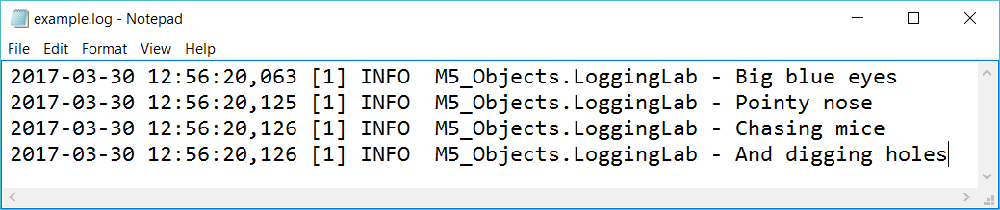
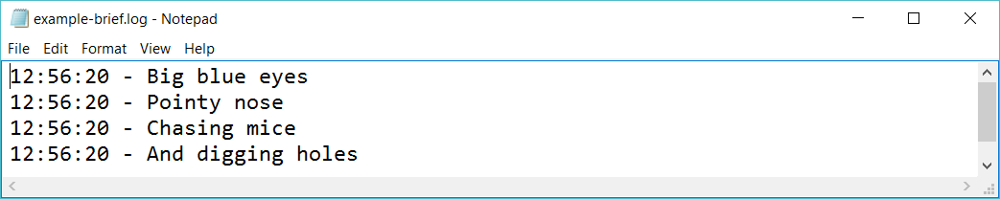

# 5.5 Logging with log4net

Install *log4net*

Create four log messages. Configure so the messages are sent to three different places:

- The console
- The file example.log
- The file example-brief.log

This is the output from the console (when the time is 12:56:20):

This is the file example.log: 

And this is example-brief.log:

Here are some good guides about log4net:

- https://stackoverflow.com/questions/46169606/how-to-use-log4net-in-asp-net-core-2-0
- https://stackify.com/log4net-guide-dotnet-logging/
- http://www.beefycode.com/post/log4net-tutorial-pt-7-filters.aspx

## Extra

1. Investigate the difference between *FileAppender* and *RollingFileAppender*

2. Try *DebugAppender*

3. Try *ColoredConsoleAppender*

4. Create a log that writes to file *example-mail.log* that only logs messages with a message that contains “Email message” or “Mailserver”.

5. Create a log that writes to file *example-error.log*. Log messages with status ERROR or FATAL.

6. If the user enters a specific value then create an exception. Write the line number of the error is a logfile.

7. Create your own appender (hard!)