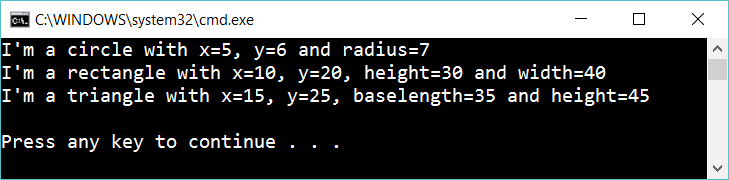

# 6.3 Override ToString

Create **Circle** class with x, y and radius fields
Create **Rectangle** class with x, y, width and height fields
Create **Triangle** class with x, y, baselength and height fields

Implement *ToString* for all three classes.

Create an instance of Circle. Call ToString to write info about the object.
Create an instance of Rectangle. Call ToString to write info about the object.
Create an instance of Circle. Call ToString to write info about the object.

## Extra

A Circle, Rectangle and Triangle can be pretty (or not). Create methods that set this state.

Change *ToString*-implementation so it takes care of this

I’m a pretty circle with ...
I’m an ugly rectangle with ...