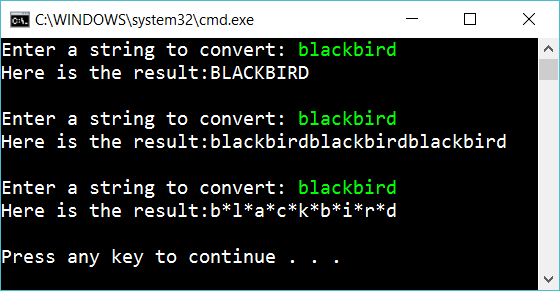

# 9.1 Delegates

Create three methods:

    string ToUpper(string s)
    string Tripple(string s)
    string AddStars(string s)

**ToUpper** should convert the string to uppercase letters.

**Tripple** should return the string three times in a row

**AddStars** adds a star between each letter

Create three method

    void AskAndRespond_ToUpper()
    void AskAndRespond_Tripple()
    void AskAndRespond_AddStars()

Use these methods to create the following app:

Next, solve the same problem, but create a generic method:

    void AskAndRespond(Func<string, string> converter)

Now you don't need the three previous methods.

## Extra

1. Is the new solution better or worse?
2. Add two parameters to *AskAndRespond* so you can change the texts ("Enter a string..." and "Here is the...")
2. Create one more method and use it in the same way
3. Add one more parameter for the method *AskAndRespond* with the type *Func<string, int>*
3. Create a method that takes *Func<int, string>* as a parameter and use it.