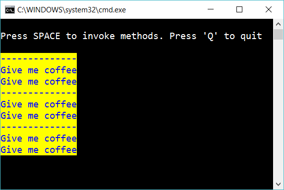

# 9.3 Events

Create some simple methods that write a message and set color:

    void WriteLine()
    void GiveMeCoffee()
    void SetColorBlue()
    void SetBackgroundYellow()

Create an event spacePressed:

    delegate void MyAction();
    event MyAction spacePressed;

In your main program, add methods to the invocation list:

    spacePressed += SetColorBlue;
    spacePressed += SetBackgroundYellow;
    spacePressed += WriteLine;
    spacePressed += GiveMeCoffee;
    spacePressed += GiveMeCoffee;

If the user press space then invoke all the methods in the invocation list:

In the example above, the user has pressed space three times.

## Extra

1. Add one more method that is triggered by space as well

2. Create a program that let the user decide which methods that should be invoced when space is pressed.

3. Create a program that reads an JSON file to decide which methods that should be invoced when space is pressed.