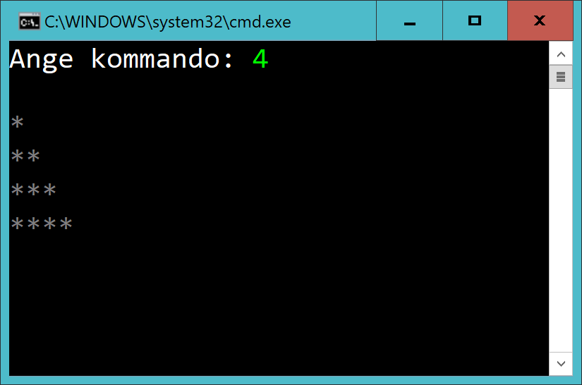
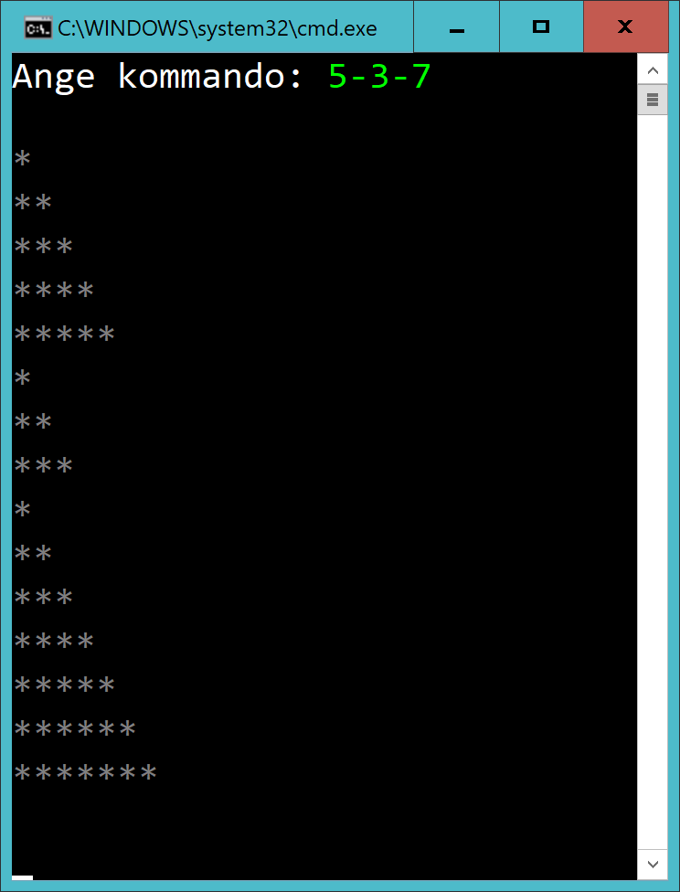
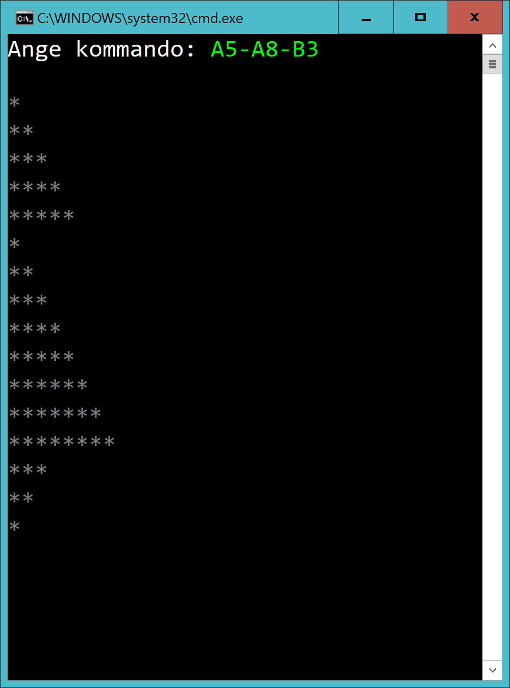

# Checkpoint01 - Trianglar

## Intro

Skapa en consoleapp med projektnamnet *Checkpoint01*. Skapa en mapp i projektet som du döper till ditt namn, t.ex *OscarOlsson*. I den mappen skapa en klass *App.cs*.

Lämna bara in filen *App.cs*

Lämna bara in en version. Du kan börja direkt på version 2 eller 3 om du vill och skippa tidigare versioner.

## Version 1

Användaren matar in **en** siffra. Rita ut en triangel mha stjärnor (eller annat tecken). Triangeln ska ha samma bas och höjd som användaren anger.

## Version 2

Samma som Version 1, men användaren kan mata in en lista av siffror.

Listans tal separeras med streck

Trianglarna ska ritas upp under varandra

## Version 3

Användaren ska kunna skapa trianglar av två sorter:

- Triangel A har en spets i toppen
- Triangel B har en spets i botten

Exempel:

- Triangeln A2 har en spets i toppen och storleken 2.
- Triangeln B4 har en spets i botten och storleken 4.

Exempelkörning:

