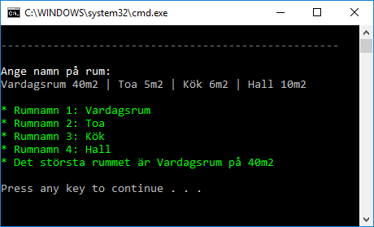

# Checkpoint02 - Rum

## Intro

Skapa en consoleapp med projektnamnet *Checkpoint02*. Skapa en mapp i projektet som du döper till ditt namn, t.ex *OscarOlsson*. I den mappen skapa en klass *App.cs*.

Lämna in hela mappen (t.ex *OscarOlsson*) alternativt bara *App.cs*-filen.

Lämna bara in en version. Du kan börja direkt på version 2 eller 3 om du vill och skippa tidigare versioner.

## Level 1

Användaren matar in exakt **tre** rum. Pipetecknet används som separator.

Skriv en Room-klass och skapa tre rum:

    var r1 = new Room("...")
    var r2 = new Room("...")
    var r3 = new Room("...")

Skriv sedan utan rummens namn:

## Level 2

Användaren matar in rumsnamn tillsammans med storlek på rummet. Storleken anges med en siffra samt texten "m2". Se nedan.

Skriv ut rummen och skriv även ut vilket rum som är störst samt dess storlek.

## Level 3

Användaren skriver nu rum i detta format:

    Rumsnamn Kvadratmeter LjusetPåEllerEj

T.ex

    Salong 15m2 On

Ljuset i ett rum är antingen på eller av: **On** eller **Off**.

Validera användarens input. Ge meddelande om användaren matar in på fel format. Upprepa i all evighet.

När användaren matar in rätt input så skriv ut:
- Vilka rum som är tända (om något) 
- Vilket rum som är störst 
- Hur många rum som har angivits

Se nedan för hur datan ska presenteras.

## Level 4

Snygga till koden. 

Se över namn på variabler och metoder. Fixa för långa metoder.

Försök göra koden så lättläst som möjligt.

Bryt ut Console-delen så det är lätt att testa dina klasser och metoder.