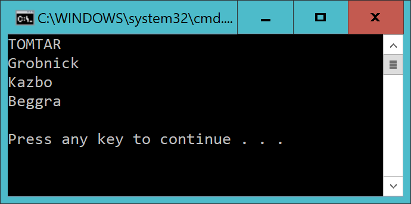
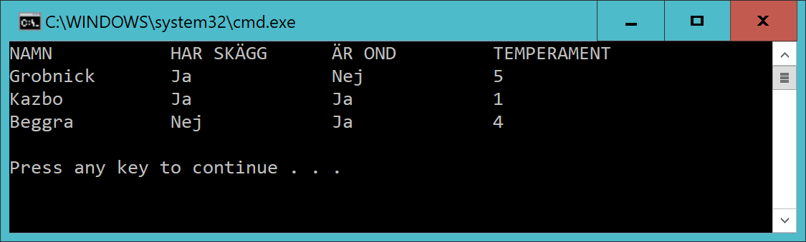

# Checkpoint04 - Tomtar

## Intro

Lämna in **en** cs-fil med din programkod. 

(Om du skapar flera klasser så lägg alltså klasserna i samma fil)

## Level 1

Skapa en databas **GnomeDb** med en tabell **Gnome**

Lägg in tre tomtar i gnome-tabellen. Varje tomte har ett namn.

Gör en console-app som skriver ut namnen på alla tomtar.

Använd denna connectionsträng:

	string conString = "Server = (localdb)\\mssqllocaldb; Database = GnomeDb; Trusted_Connection = True;"

Exempel om du lagt in tre tomtar:

## Level 2

Uppdatera gnome-tabellen enligt nedan.

Varje tomte:
- har ett namn
- har skägg eller är skägglösa
- är ond eller god
- har ett temperament (en siffra mellan 1 och 5)

Skriv ut info om alla tomtar:

## Level 3

Samma som *Level 2* men stuva om koden så du har en metod som hämtar tomtarna och en som skriver ut dem.

Skapa en klass *Gnome* med lämpliga properties.

Ditt huvudprogram ska alltså se ut såhär:

	List<Gnome> x = GetGnomesFromDatabase();
	DisplayGnomes(x);

